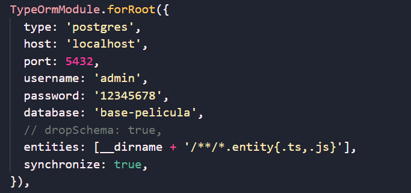
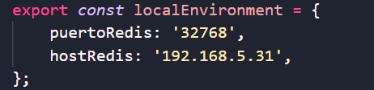

# guitierrez-carlos

Repositorio de Carlos Guitierrez

# INSTRUCCIONES PARA LEVANTAR LA APLICACION

* Descargar la aplicacion de rama **desarrollo**

## Configurar Base Datos

* Crear base "base-pelicula"
* Crear un usuario "admin" y password "12345678"

(Esta aplicacion esta probada en una base postgres 9.6)

## Configurar archivos Redis y Base de datos
* Configurar base de datos en el directorio

**back-final/src/app.module.ts**

* Configurar las credenciales de Redis en el directorio

**back-final/src/local-environment.ts**

## Levantar el servidor 
(En una consola dentro de la carpeta del proyecto)
* Para levantar back-end 
    * ir a la carpeta back-final: **cd back-final**
    * inicial el servidor: **npm run start**

(En otra consola)
* Para levantar front end
    * ir a la carpeta front-final: **cd front-final**
    * inicial el servidor: **ng s**

## La aplicacion se levantara en localhost:4200

# (Nota): para acceder sin login ingresar a http://localhost:4200/#/aplicacion/inicio